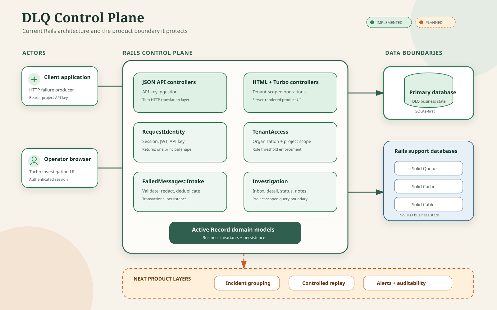
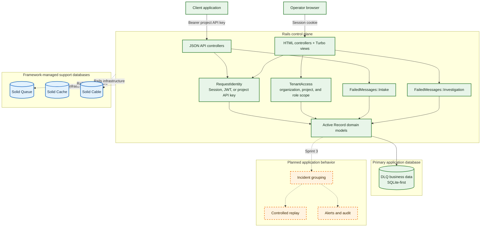
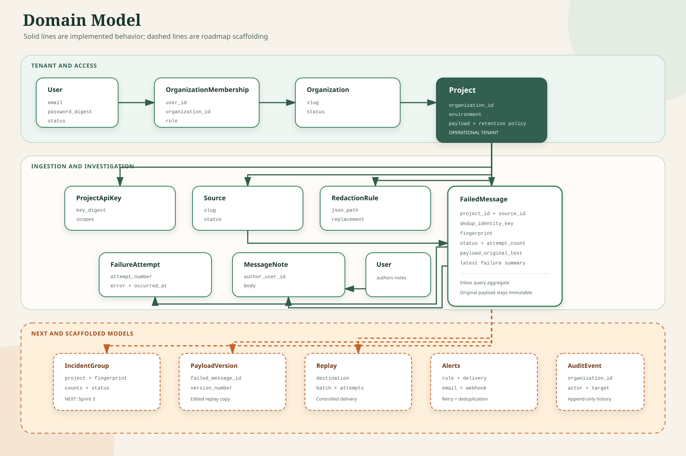
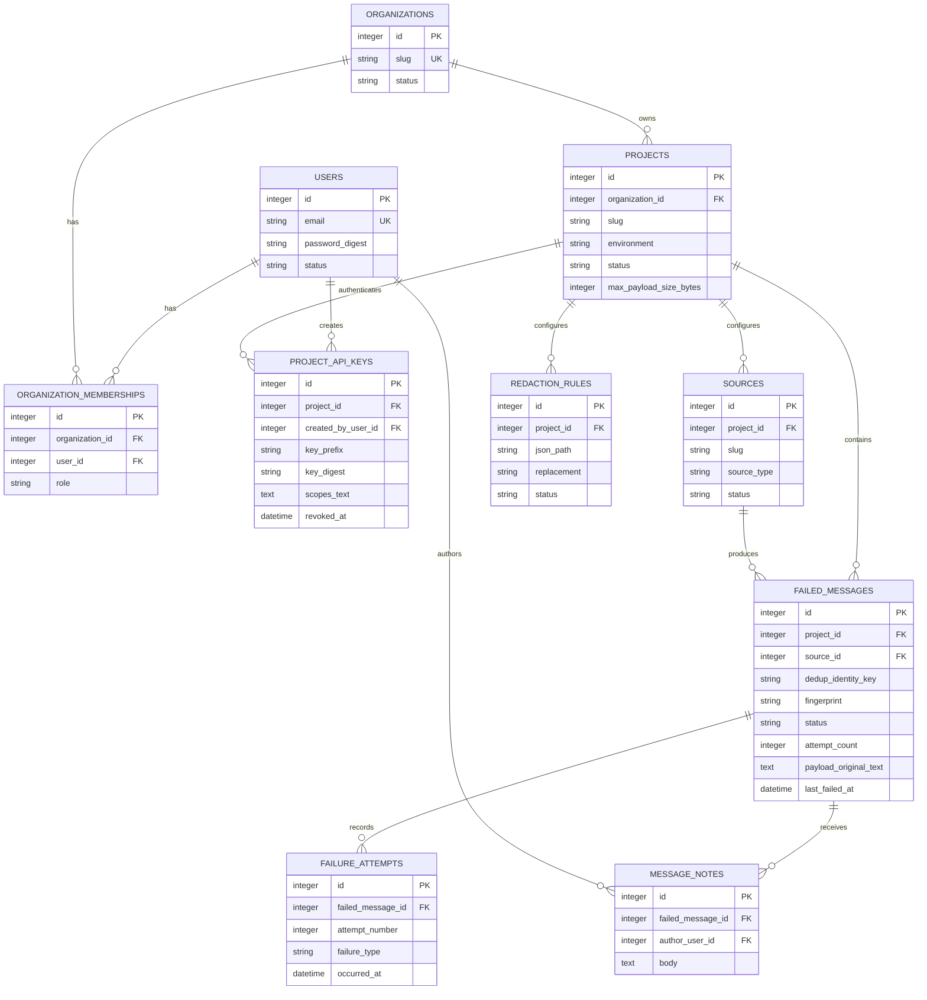
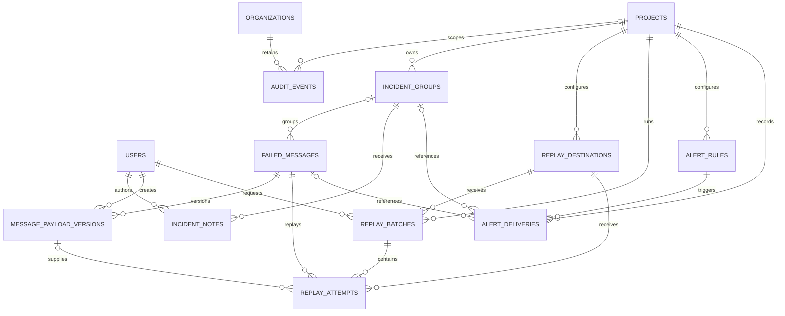
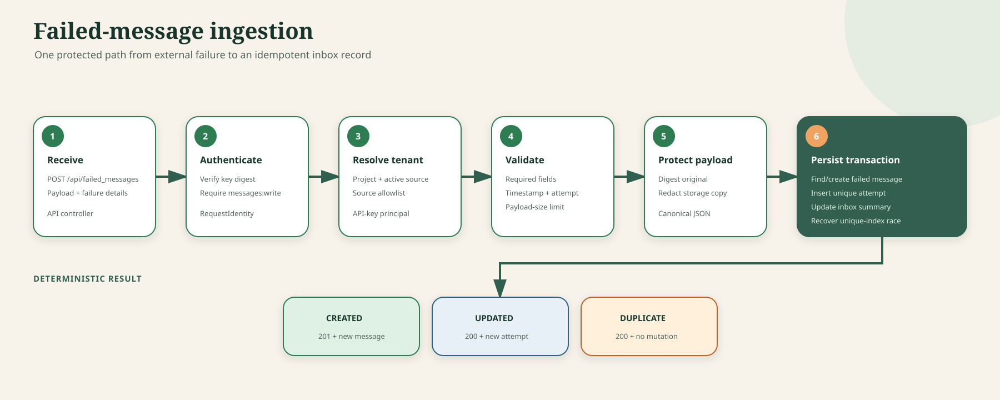
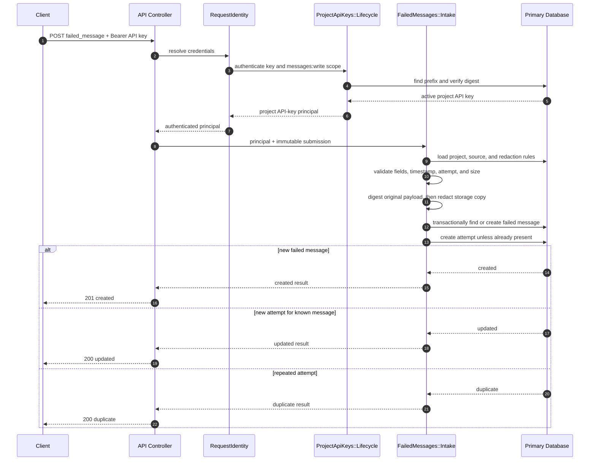
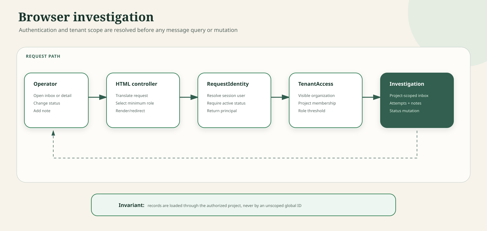
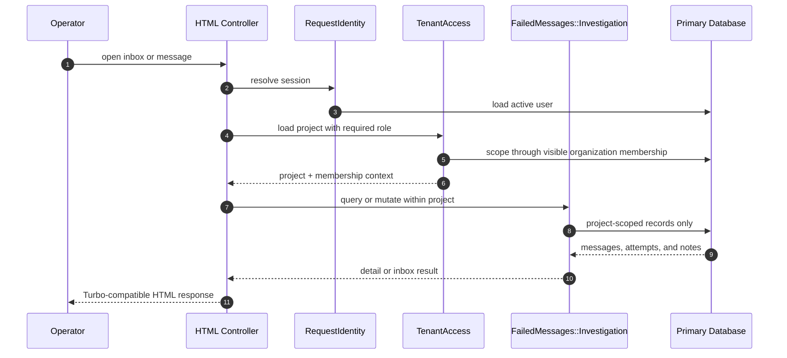

# DLQ as a Service Models and Architecture

This document illustrates the current Rails architecture and the domain model that supports the product roadmap. Rendered SVG and PNG images live in `docs/images`; collapsible Mermaid blocks remain the editable source reference.

## Status Legend

- **Implemented:** working Phase 1/2 behavior with automated coverage
- **Next:** schema exists and Sprint 3 behavior is planned next
- **Scaffolded:** tables or shallow models exist, but product behavior is not implemented
- **Framework-managed:** Rails infrastructure outside the DLQ business model

## System Architecture



<details>
<summary>Editable Mermaid source</summary>



</details>

### Architectural Boundaries

- Controllers translate HTTP requests and responses; workflow rules belong in services.
- `RequestIdentity` resolves a user or project API-key principal without coupling authentication methods to controllers.
- `TenantAccess` is the browser authorization boundary and must scope records through visible organizations and projects.
- `FailedMessages::Intake` owns validation, redaction, deduplication, and transactional persistence.
- `FailedMessages::Investigation` owns inbox queries, detail composition, notes, and status changes.
- The primary database owns business state. Solid Queue, Cache, and Cable remain framework infrastructure.

## Implemented Domain Model

This ER diagram shows models with working Phase 1/2 behavior. Attributes are intentionally limited to identity, tenancy, and operationally important fields.



<details>
<summary>Editable Mermaid source</summary>



</details>

### Tenant Shape

```text
User -> OrganizationMembership -> Organization -> Project -> DLQ records
```

`Project` is the operational tenant boundary. Every ingestion, inbox, incident, replay, and alert query must resolve through a project rather than accepting an unscoped record ID.

## Roadmap Model Extensions

These relationships exist in the database schema, but most corresponding workflows are not implemented. Incident behavior is next; replay, alerts, and audit follow later.

The roadmap models appear in the lower, dashed section of the domain-model image above.

<details>
<summary>Roadmap relationship source</summary>



</details>

Important invariants:

- an incident fingerprint is unique within a project, not globally
- a failed message may have no incident until Sprint 3 assignment is implemented
- the original payload remains immutable; replay edits create `message_payload_versions`
- single-message replay still belongs to a `replay_batch`
- audit events remain organization-owned so history can outlive retained payload content

## Ingestion Sequence

This is the implemented `POST /api/failed_messages` flow.



<details>
<summary>Editable Mermaid source</summary>



</details>

## Browser Investigation Sequence



<details>
<summary>Editable Mermaid source</summary>



</details>

## Evolution Rules

- Update the implemented ER diagram when a model becomes active product behavior.
- Keep scaffolded relationships in the roadmap diagram until their service, authorization, UI/API, and tests exist.
- Add new workflows behind application-service boundaries rather than expanding controllers.
- Preserve project scoping in every new query and organization ownership for audit history.
- Update both the rendered image and its Mermaid reference when architecture changes.
